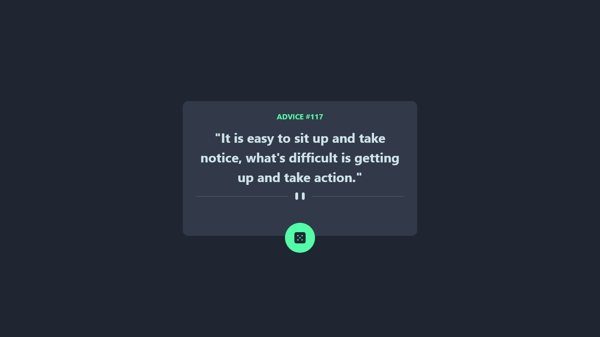

# Frontend Mentor - Advice generator app solution

This is a solution to the [Advice generator app challenge on Frontend Mentor](https://www.frontendmentor.io/challenges/advice-generator-app-QdUG-13db). Frontend Mentor challenges help you improve your coding skills by building realistic projects.

## Table of contents

- [Overview](#overview)
  - [The challenge](#the-challenge)
  - [Screenshot](#screenshot)
  - [Links](#links)
- [My process](#my-process)
  - [Built with](#built-with)
  - [Useful resources](#useful-resources)
- [Author](#author)

## Overview

### The challenge

Users should be able to:

- View the optimal layout for the app depending on their device's screen size
- See hover states for all interactive elements on the page
- Generate a new piece of advice by clicking the dice icon

### Screenshot

### Links

- Solution URL: [HERE](https://github.com/Himesh9512/Advice-generator-app)
- Live Site URL: [LIVE](https://Himesh9512.github.io/Advice-generator-app)

## My process

### Built with

- HTML 5
- CSS stylesheets
- [TailwindCSS](https://tailwindcss.com) - css framwork
- [ReactJS](https://reactjs.org/) - JS framework

### Useful resources

- [Tailwind Documantation](https://tailwindcss.com/docs/) - I used this documantation as referance and It is a necessasy thing if you want to work with tailwind 

## Author

- Frontend Mentor - [@Himesh9512](https://www.frontendmentor.io/profile/Himesh9512)
- Github - [@Himesh9512](https://www.github.com/Himesh9512)
